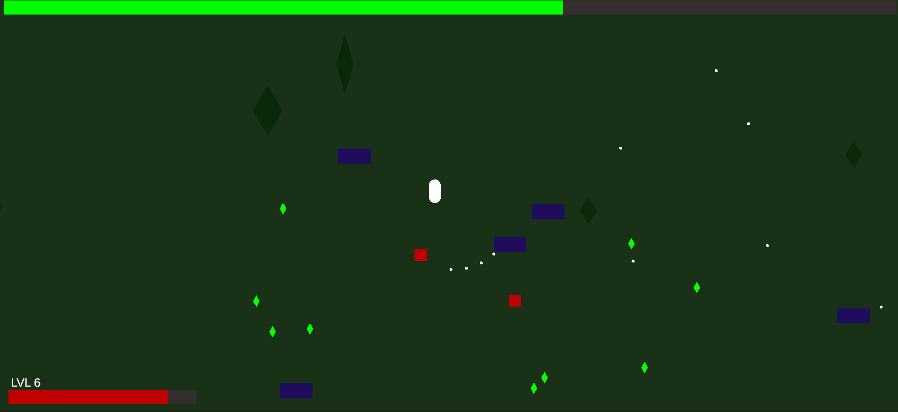

# ExtinctionMarine – High-Performance 2D Top-Down Bullet Hell Simulation 🦖

> A high-performance 2D Roguelite/Bullet-Hell survival game emphasizing clean architecture, memory management, and complete separation of business logic from the game engine.

  
   
  <em>Core gameplay loop: Event-driven UI, zero-allocation entity pooling, and decoupled domain logic in action.</em>

  
   
  <em>Gameplay Preview: Action-packed combat featuring scale-aware swarm AI and custom upgrade mechanics.</em>

## 🏗️ Technical Showcase & Architecture

This simulation was designed from the ground up using **Domain-Driven Design (DDD)** concepts to demonstrate how a game engine can be treated purely as an infrastructure/presentation layer.

### 1. Engine-Agnostic Core Logic (Clean Architecture)
The entire game state evaluation, experience tables, leveling math, and base entity configurations do not rely on Unity APIs. They are encapsulated inside a pure, decoupled C# Class Library (`GameLogic.dll`).
* **The Domain:** Entities like `PlayerEntity`, `RaptorEntity`, `TRexEntity`, and `DiplodocusEntity` inherit from a clean C# `Entity` abstraction.
* **Benefit:** The core mechanics are 100% unit-testable outside of Unity, completely immune to engine overhead, and could easily be ported to another framework or server architecture.

### 2. Zero-Allocation Swarm Mechanics (Advanced Object Pooling)
To sustain hundreds of active entities and projectiles simultaneously at 60+ FPS even on old hardware, the runtime completely bypasses the Garbage Collector (GC):
* **Optimized Queries:** Replaced all deprecated non-alloc APIs with the modern **Unity 6 compliant `Physics2D.OverlapCircle` utilizing static `ContactFilter2D.noFilter` buckets** to process neighborhood updates directly within pre-allocated `Collider2D[]` arrays.
* **Hybrid Disposal Patterns:** Regular swarm enemies (`EnemyPool`) and drop items (`GemPool`) utilize robust object recycle queues. High-tier Boss entities leverage dynamic `Instantiate` pipelines but share the exact same unified interface via explicit functional lambda callbacks (`Action<EnemyController> onDeath`).

### 3. Scale-Aware Swarm AI (Boids Separation)
Standard top-down physics engines suffer from "clumping" anomalies when pushing hundreds of steering agents toward a single target. This engine features a custom **Anti-Jitter Swarm Separation Algorithm**:
* **Edge-to-Edge Distance Calculation:** Instead of measuring center-to-center transforms (which collapses large hitboxes), the AI calculates distances utilizing the `Physics2D.Distance` schema.
* **Mass & Extents Awareness:** Small `MicroRaptors` organically yield to massive `Diplodocus (7x10)` blockades via runtime bounding volume checks (`bounds.extents.sqrMagnitude`), dynamically amplifying separation forces with a smooth, linear velocity `Vector2.Lerp`.

### 4. Modular Interface-Driven Upgrade System
Weapon and marine stats scale dynamically through a highly decoupled interface ecosystem (`IUpgrade`).
* Modifiers like `DamageUpgrade`, `SplitShotUpgrade`,  `MaxHealthUpgrade`, `HealUpgrade`, `SpeedUpgrade`, `MagnetUpgrade` and `FireRateUpgrade` alter structural thresholds at runtime.

### 5. Dynamic Event-Driven Data Pipelines
Tight coupling is eliminated by communicating exclusively through data-carrying decoupled event streams:
* Enemies evaluate damage thresholds inside the domain layer and broadcast events containing both positional coordinates and exact runtime domain data (`Action<Vector3, float> OnEnemyKilled`).
* The `GemPool` intercepts this broadcast, dynamically configuring empty pooled `ExpGem` structures with individual `XpReward` payloads on the fly, eliminating hardcoded value schemas.

## 💻 Technical Stack

* **Ecosphere:** .NET Standard 2.1
* **Game Engine:** Unity 6 LTS (Version 6000.3.17f1+ compliant).
* **Render Pipeline:** Universal Render Pipeline (URP 2D).
* **Input System:** Unity Input System Package (Fully event-driven action binding architecture).

## ⚖️ License
Copyright (c) 2026 Mikołaj Jussak. All rights reserved.

See [`LICENSE`](./LICENSE) for more information.
  
