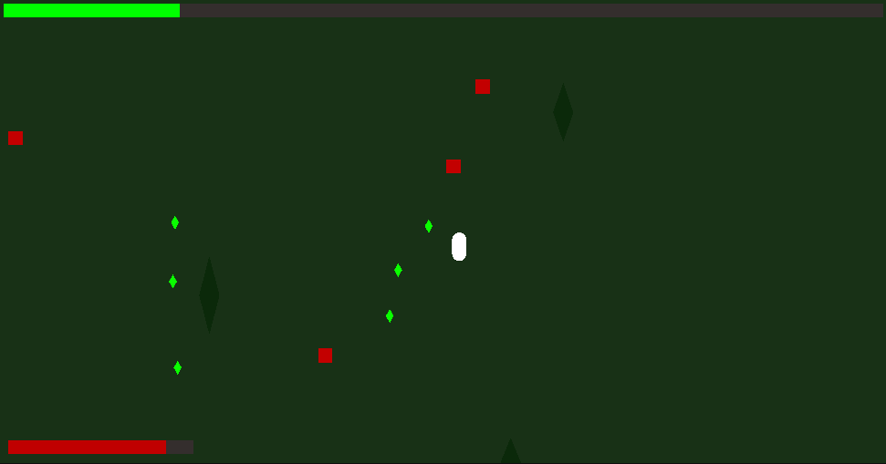

# ExtinctionMarine – High-Performance 2D Top-Down Bullet Hell Simulation 🦖

> A high-performance 2D Roguelite/Bullet-Hell survival game emphasizing clean architecture, memory management, and complete separation of business logic from the game engine.

  
   
  <em>Core gameplay loop: Event-driven UI, zero-allocation entity pooling, and decoupled domain logic in action.</em>

## 🏗️ Technical Showcase & Architecture
This project was built from the ground up not just as a game, but as a demonstration of scalable C# engineering practices.
### 1. Engine-Agnostic Business Logic
The core game rules (HP math, experience systems, entity stats) do not live in Unity. They are encapsulated in a completely independent, pure C# class library (`GameLogic.dll` targeting **.NET Standard 2.1**). 
* **Benefit:** The Unity layer acts solely as a View/Controller. The business logic is fully unit-testable outside the game engine environment.

  
* ### 2. Zero-Allocation Gameplay (Object Pooling)
To survive the demanding performance requirements of a bullet-hell game, the Garbage Collector (GC) is bypassed during runtime.
* Custom `Queue<T>` based Object Pools manage all projectiles, enemy entities, and EXP gems. 
* Objects are instantiated once upon level load and continuously recycled, ensuring a steady 60+ FPS even with hundreds of entities on screen.

### 3. Event-Driven Decoupling
Tight coupling is avoided by utilizing the **Observer Pattern** (`Action`, `EventHandler`). 
* Systems communicate via broadcasts. For example: An enemy dying triggers a strict `OnEnemyKilled` action. The `GemPool` listens to this event to spawn an EXP gem, and the UI listens to update the kill counter—without these classes ever referencing each other.

---
## 💻 Tech Stack
* **Language:** C# 9.0
* **Framework:** .NET Standard 2.1 (Domain Logic)
* **Engine:** Unity 2022+ (Presentation Layer)
* **Input:** New Unity Input System (Event-based)
---

## 🚀 Tech Stack

* **Language:** C# (.NET 8+ compliant compiler features)
* **IDE:** Visual Studio 2026 Insiders
* **Engine Framework:** Unity 6 LTS (Universal Render Pipeline 2D)
* **Input Architecture:** Unity Input System Package (Event-Driven Architecture)

## ⚖️ License
Copyright (c) 2026 Mikołaj Jussak. All rights reserved.

See [`LICENSE`](./LICENSE) for more information.
  
